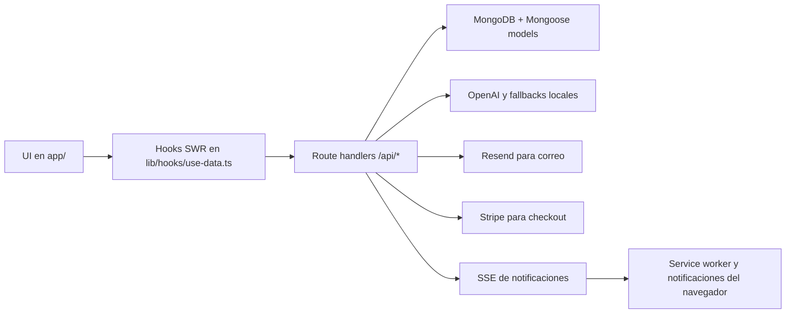

# TOCHI Legal Suite Documentation

Esta es la documentacion central del proyecto. Resume como esta organizado TOCHI, que hace cada modulo, como hablar con la API, como se modelan los datos y como desplegarlo sin perder persistencia ni funcionalidad legal.

## Lectura recomendada

1. [Manual ejecutivo](executive-manual.md)
2. [Arquitectura](architecture.md)
3. [Modulos funcionales](modules.md)
4. [Referencia de APIs](api-reference.md)
5. [Modelos de datos](data-models.md)
6. [Despliegue y operaciones](deployment-ops.md)

## Resumen del producto

TOCHI Legal Suite es una plataforma para abogados y firmas que centraliza:

- gestion de clientes y casos,
- agenda y seguimiento de citas,
- documentos y aprobaciones,
- facturacion y suscripciones,
- comunicacion con clientes,
- notificaciones en tiempo real,
- biblioteca legal y busqueda juridica,
- IA para apoyo en consulta, generacion de documentos e intake.

## Estado funcional actual

- El flujo principal ya no depende de pantallas demo.
- Los formularios clave guardan en MongoDB.
- La IA cuenta con fallback local para no romper la experiencia cuando OpenAI falla.
- La biblioteca legal usa catalogo local, fuentes oficiales y busqueda vectorial.
- Las notificaciones trabajan con persistencia mas SSE y soporte de notificacion de navegador.

## Roles soportados

- `superadmin`: control total del sistema.
- `admin`: gestion operativa completa.
- `abogado`: operacion diaria de casos, documentos, citas, facturacion y IA.
- `asistente`: apoyo operativo y seguimiento.
- `cliente`: acceso al portal con documentos, citas, mensajes y aprobaciones.

## Estructura de alto nivel

- `app/`: rutas de interfaz y API del runtime principal.
- `components/`: componentes reutilizables de UI y de dominio.
- `lib/`: modelos, servicios, hooks, utilidades y motores de negocio.
- `scripts/`: ingesta legal, scraping, embeddings, limpieza y diagnostico.
- `infrastructure/`: Docker, Kubernetes y Terraform.
- `lib/data/`: textos legales, PDFs, JSONs y catalogos de apoyo.
- `frontend/`: copia separable del frontend para desplegar en Cloud Run si quieres dividir la arquitectura.

## Flujo basico



## Punto de partida para revisar el codigo

- `app/dashboard/page.tsx`
- `app/dashboard/casos/page.tsx`
- `app/dashboard/clientes/page.tsx`
- `app/dashboard/citas/page.tsx`
- `app/dashboard/documentos/page.tsx`
- `app/dashboard/facturacion/page.tsx`
- `app/dashboard/comunicacion/page.tsx`
- `app/dashboard/notificaciones/page.tsx`
- `app/dashboard/leyes/page.tsx`
- `app/dashboard/herramientas/biblioteca/page.tsx`
- `app/dashboard/herramientas/consulta-procesos/page.tsx`
- `app/dashboard/herramientas/verificador/page.tsx`
- `app/dashboard/intake/page.tsx`
- `components/legal/legal-code-detail-view.tsx`

## Comandos utiles

```bash
npm install
npm run dev
npm run build
npm run lint
npx tsc -p tsconfig.json --noEmit
```

## Observaciones

- El modo demo fue eliminado del flujo principal.
- La numeracion, los clientes, las citas, las comunicaciones y las facturas dependen de backend real.
- Si falta OpenAI, el asistente legal sigue respondiendo con contexto local y fuentes de respaldo.
