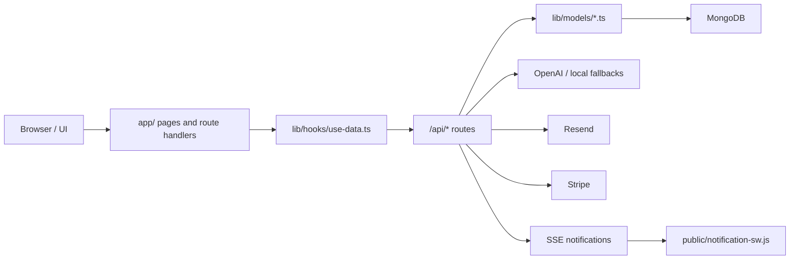

# Architecture

TOCHI Legal Suite esta construido como una app Next.js con persistencia en MongoDB, autentificacion con NextAuth, SWR para carga de datos y un conjunto de servicios de apoyo para IA, notificaciones, busqueda legal y facturacion.

## Stack principal

- Next.js 16
- React 19
- TypeScript
- MongoDB + Mongoose
- NextAuth v5
- SWR para consulta y refresco de datos
- OpenAI para IA y embeddings
- Resend para correo transaccional
- Stripe para checkout y suscripciones
- SSE y service worker para notificaciones en tiempo real

## Flujo de ejecucion

## Capas del sistema

### Presentacion

La interfaz principal vive en `app/`, `components/` y `components/legal/`. Desde ahi salen:

- dashboard operativo,
- agenda,
- clientes,
- casos,
- documentos,
- facturacion,
- comunicacion,
- portal del cliente,
- biblioteca legal,
- herramientas juridicas,
- notificaciones.

### Acceso a datos

`lib/hooks/use-data.ts` centraliza los hooks SWR y las funciones de escritura. La UI no habla directo con MongoDB, sino con handlers HTTP o server actions:

- `GET/POST/PUT/DELETE` sobre `app/api/...`
- acciones servidor para checkout
- mutaciones despues de cada operacion importante

### Persistencia

Los modelos estan en `lib/models/*.ts` y usan Mongoose. Las colecciones principales cubren:

- usuarios,
- clientes,
- casos,
- citas,
- documentos,
- facturas,
- comunicaciones,
- notificaciones,
- catalogo legal,
- busquedas de procesos,
- verificaciones,
- suscripciones.

### IA y busqueda legal

La capa legal combina varias fuentes:

- catalogo local de codigos y articulos en `lib/data/codigos/`,
- respaldos PDF y JSON en `lib/data/`,
- busqueda vectorial en `lib/services/legal-vector-search.ts`,
- fallback local en `lib/services/legal-assistant-fallback.ts`,
- generacion de documentos con IA,
- analisis de intake con IA.

### Notificaciones

El sistema de notificaciones tiene tres niveles:

1. Persistencia en MongoDB.
2. Emision en tiempo real via SSE.
3. Notificacion del navegador con service worker.

El flujo se conecta en:

- `app/api/notifications/route.ts`
- `app/api/notifications/stream/route.ts`
- `app/api/notifications/sync/route.ts`
- `public/notification-sw.js`
- `lib/services/notification-stream.ts`

### Billing y suscripciones

El modulo comercial usa:

- `lib/products.ts` para planes y limites,
- `lib/subscription.ts` para limites y trial,
- `lib/stripe.ts` y `app/actions/stripe.ts` para checkout,
- `app/checkout/[planId]/page.tsx` y `app/checkout/success/page.tsx` para la experiencia final.

### Infraestructura

Hay soporte base para:

- Docker,
- Kubernetes,
- Terraform.

Los manifiestos y plantillas estan en `infrastructure/`.

## Principios de diseno

- La UI debe persistir datos reales, no solo pintar tarjetas.
- Si falla una dependencia externa, la experiencia debe caer a fallback local sin romper el flujo.
- Los modulos legales deben priorizar fuentes oficiales y trazabilidad.
- Las alertas deben llegar por varias vias: persistidas, en tiempo real y en navegador.
- Los formularios criticos no deben depender de modo demo.
