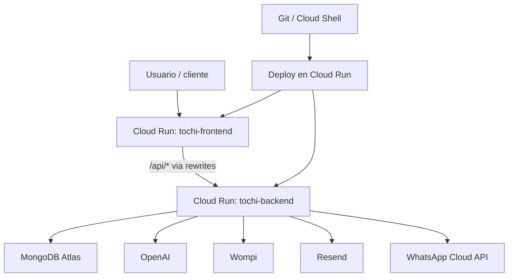

# TOCHI en Google Cloud

Este documento explica como esta montado TOCHI Legal Suite en Google Cloud, que servicio hace cada cosa, como viaja una peticion y como se despliega la aplicacion.

## 1. Resumen ejecutivo

TOCHI esta montado con una arquitectura separada en capas:

- **Frontend publico** en Cloud Run.
- **Backend / API** en Cloud Run.
- **MongoDB Atlas** como base de datos externa.
- **Servicios externos** para IA, correo, pagos y mensajeria.
- **Cloud Shell / Git / Cloud Run** como flujo principal de despliegue.

La idea es que el usuario normal entre por el frontend, y que el frontend llame al backend por medio de rutas `api` reescritas. El backend guarda y lee la informacion real en MongoDB.

## 2. Que servicios usa TOCHI

| Capa | Donde corre | Responsabilidad |
| --- | --- | --- |
| Frontend | Cloud Run | Interfaz que ve el cliente: login, dashboard, checkout, formularios y pantallas operativas |
| Backend | Cloud Run | API, autenticacion, CRUD, validaciones, IA, pagos, notificaciones y logica del servidor |
| Base de datos | MongoDB Atlas | Persistencia real de usuarios, clientes, casos, citas, documentos, facturas, etc. |
| IA | OpenAI | Embeddings, consultas legales, analisis de intake y apoyo de redaccion |
| Pagos | Wompi y Stripe | Checkout de suscripciones y pagos |
| Correos | Resend | Emails transaccionales y recuperacion de contrasena |
| Mensajeria | WhatsApp Cloud API | Integracion con mensajes y webhook |
| Despliegue | Cloud Run + Cloud Shell | Construccion y publicacion de los servicios |

## 3. Por que Cloud Run

Cloud Run es la opcion mas natural para TOCHI porque la aplicacion no es estatica:

- tiene autenticacion,
- usa rutas API,
- depende de MongoDB,
- tiene checkout de pagos,
- maneja webhooks,
- usa IA y otros servicios externos,
- necesita correr como contenedor.

Cloud Storage + Load Balancer sirve mejor para sitios estaticos. Firebase Hosting tambien funciona muy bien para frontend estaticos o SPAs simples. Pero para TOCHI, que es una suite dinamica con backend y logica del servidor, Cloud Run encaja mejor.

## 4. Estructura del proyecto

Las carpetas mas importantes para entender el montaje en Google Cloud son:

- `frontend/`: copia separable del frontend publico que se despliega como servicio independiente.
- `app/`, `components/`, `lib/`: base principal del proyecto y logica del servidor.
- `infrastructure/docker/`: Dockerfiles y docker-compose para construir contenedores.
- `infrastructure/k8s/`: manifiestos Kubernetes de referencia.
- `infrastructure/terraform/`: infraestructura declarativa de apoyo.
- `docs/`: documentacion tecnica y operativa.

## 5. Diagrama general

## 6. Como viaja una peticion

### Flujo normal de usuario

1. El usuario abre la URL publica del **frontend**.
2. El frontend renderiza login, dashboard, checkout y formularios.
3. Cuando la interfaz necesita datos, hace llamadas a `/api/*`.
4. En `frontend/next.config.mjs`, esas rutas se reescriben hacia el backend usando `NEXT_PUBLIC_API_URL`.
5. El backend recibe la peticion, valida autenticacion y lee o escribe en MongoDB.
6. Si hace falta, el backend consulta OpenAI, Resend, Wompi o WhatsApp.
7. La respuesta vuelve al frontend y se muestra en pantalla.

### Flujo de pago

1. El usuario entra a la pagina de suscripcion.
2. El componente de checkout carga el widget de Wompi.
3. El usuario elige pago con tarjeta o Nequi.
4. El frontend crea la sesion de checkout con una accion de servidor.
5. Wompi redirige o confirma el pago.
6. El webhook valida el evento y actualiza el estado de la suscripcion.

## 7. Archivos clave de la arquitectura

### Frontend publico

- `frontend/app/page.tsx`
- `frontend/app/login/page.tsx`
- `frontend/app/register/page.tsx`
- `frontend/app/checkout/[planId]/page.tsx`
- `frontend/components/checkout/checkout-form.tsx`
- `frontend/app/actions/wompi.ts`
- `frontend/app/api/payments/wompi/webhook/route.ts`
- `frontend/app/api/payments/wompi/status/route.ts`
- `frontend/next.config.mjs`
- `frontend/lib/wompi.ts`

### Backend y logica principal

- `app/page.tsx`
- `app/dashboard/page.tsx`
- `app/api/*`
- `lib/auth.ts`
- `lib/mongodb.ts`
- `lib/subscription.ts`
- `lib/products.ts`
- `lib/models/*`

### Infraestructura

- `frontend/Dockerfile`
- `infrastructure/docker/Dockerfile`
- `infrastructure/docker/docker-compose.yml`
- `infrastructure/k8s/*`
- `infrastructure/terraform/*`

## 8. URL publicas actuales

En este despliegue las URLs actuales son:

- **Frontend publico:** `https://tochi-frontend-712790578749.us-central1.run.app`
- **Backend / API:** `https://tochi-backend-712790578749.us-central1.run.app`

Regla practica:

- La URL que se comparte con clientes es la del **frontend**.
- La URL del **backend** se usa para API, autentificacion y logica del servidor.

## 9. Variables de entorno mas importantes

### Base

- `MONGODB_URI`: conexion con MongoDB Atlas.
- `AUTH_SECRET` / `NEXTAUTH_SECRET`: firma de autenticacion.
- `AUTH_URL` / `NEXTAUTH_URL`: URL publica base de autenticacion.
- `NEXT_PUBLIC_APP_URL`: URL publica del frontend.
- `NEXT_PUBLIC_API_URL`: URL publica del backend.
- `AUTH_COOKIE_DOMAIN`: dominio compartido si se usan subdominios.

### Servicios externos

- `OPENAI_API_KEY`: IA, embeddings y soporte de redaccion.
- `RESEND_API_KEY`: correos transaccionales.
- `MAIL_FROM`: remitente de correo.
- `WOMPI_PUBLIC_KEY`: checkout de Wompi.
- `WOMPI_INTEGRITY_SECRET`: firma de checkout.
- `WOMPI_EVENT_SECRET`: validacion de webhook.
- `WHATSAPP_CLOUD_API_TOKEN`: integracion con WhatsApp Cloud API.
- `WHATSAPP_ACCESS_TOKEN`: alias opcional del token.
- `WHATSAPP_PHONE_NUMBER_ID`: id del numero de WhatsApp Business.
- `WHATSAPP_WEBHOOK_VERIFY_TOKEN`: token de verificacion.

### Operacion

- `DISABLE_PLAN_LIMITS`: desactiva limites en desarrollo.
- `CRON_SECRET`: protege los endpoints de automatizacion programada.

## 10. Como se despliega

Hay dos formas comunes de actualizar TOCHI en Google Cloud:

### Opcion A: desplegar desde el codigo fuente

Cloud Run toma el codigo, lo construye y publica una nueva revision.

### Opcion B: desplegar desde imagen Docker

1. Se construye la imagen.
2. Se sube a Artifact Registry.
3. Cloud Run despliega esa imagen.

En la practica, lo importante es que cada cambio relevante termine en una nueva revision de Cloud Run.

## 11. Que se actualiza cuando cambias algo

- Si cambias archivos dentro de `frontend/`, actualizas el servicio **tochi-frontend**.
- Si cambias archivos de la raiz (`app/`, `components/`, `lib/`, `app/api/`), actualizas el servicio **tochi-backend**.
- Si cambias variables de entorno, tambien debes redeployar el servicio que las usa.

## 12. Como explicarlo al profesor

Puedes explicarlo asi:

1. TOCHI esta dividido en dos servicios de Cloud Run: frontend y backend.
2. El frontend es la interfaz que ve el usuario.
3. El backend maneja autenticacion, base de datos, pagos, IA y APIs.
4. MongoDB Atlas guarda la informacion real.
5. El frontend redirige las llamadas `/api/*` al backend con `NEXT_PUBLIC_API_URL`.
6. Las integraciones externas son OpenAI, Wompi, Resend y WhatsApp.
7. Se usa Cloud Run porque la aplicacion es dinamica y no es solo una pagina estatica.

### Frase corta de presentacion

> TOCHI esta montado en Google Cloud con dos servicios Cloud Run: uno para el frontend publico y otro para el backend/API. El frontend llama al backend por rutas reescritas, el backend persiste en MongoDB Atlas y conecta servicios externos como OpenAI, Wompi, Resend y WhatsApp.

## 13. Puntos de cuidado

- El frontend es el enlace que se debe compartir con clientes.
- El backend puede responder a rutas propias, pero no es la entrada principal para usuarios finales.
- MongoDB no esta dentro de Google Cloud en este montaje; esta fuera como servicio externo.
- Wompi necesita sus claves reales para que el checkout de Nequi y tarjeta funcione de verdad.
- OpenAI, Resend y WhatsApp tambien dependen de credenciales validas.

## 14. Resumen final

TOCHI no esta montado como una pagina estatica. Esta montado como una suite legal moderna:

- frontend publico en Cloud Run,
- backend/API en Cloud Run,
- base de datos externa en MongoDB Atlas,
- integraciones externas para IA, pagos, correo y mensajeria.

Ese es el montaje que debes explicar cuando te pregunten como corre en Google Cloud.
