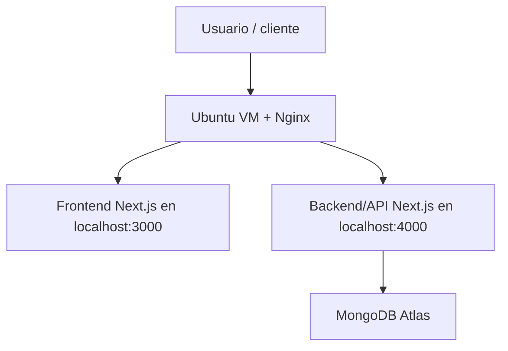

# TOCHI en Ubuntu VM

Esta guia explica la ruta alternativa cuando el profesor pide Ubuntu. En vez de usar Cloud Run, TOCHI corre en una VM Ubuntu de Google Compute Engine. MongoDB sigue fuera, en Atlas.

## Cuándo usar esta ruta

- Si te piden una arquitectura clasica con servidor Linux.
- Si quieres mostrar control completo del servidor.
- Si necesitas explicar Nginx, systemd, puertos y despliegue manual.

Si la app ya esta bien en Cloud Run, no hace falta migrarla por obligacion. Esta guia es la version “Ubuntu en servidor propio”.

## Arquitectura



## Idea general

- Una VM Ubuntu en Compute Engine actua como servidor.
- Nginx recibe el trafico publico por 80/443.
- El frontend corre en un proceso local.
- El backend corre en otro proceso local.
- Los subdominios apuntan a la misma IP publica de la VM.

Mapa recomendado de DNS:

- `www.tochilegalsuite.online` -> IP publica de la VM
- `api.tochilegalsuite.online` -> IP publica de la VM
- `tochilegalsuite.online` -> IP publica de la VM o redireccion a `www`

## Archivos listos en el repo

- `infrastructure/ubuntu/setup-ubuntu.sh`
- `infrastructure/ubuntu/update-ubuntu.sh`
- `infrastructure/ubuntu/systemd/tochi-backend.service`
- `infrastructure/ubuntu/systemd/tochi-frontend.service`
- `infrastructure/ubuntu/nginx/tochi.conf`
- `infrastructure/ubuntu/env/backend.env.example`
- `infrastructure/ubuntu/env/frontend.env.example`

La idea es copiar estas plantillas a la VM, completar los secretos reales y ejecutar el script de instalacion.

## Requisitos

- VM con Ubuntu 22.04 o 24.04.
- IP publica estatica.
- Firewall abierto para 22, 80 y 443.
- Node.js 20 o 22.
- Nginx.
- Git.
- Certbot para SSL.
- MongoDB Atlas ya configurado.

## Paso 1. Crear la VM

1. En Google Cloud, crea una VM en Compute Engine.
2. Asigna una IP estatica.
3. Abre puertos:
   - `22` para SSH
   - `80` para HTTP
   - `443` para HTTPS
4. Instala Ubuntu.

## Paso 2. Preparar el servidor

Entra por SSH y ejecuta:

```bash
sudo apt update
sudo apt upgrade -y
sudo apt install -y git nginx build-essential curl
```

Instala Node.js:

```bash
curl -fsSL https://deb.nodesource.com/setup_20.x | sudo -E bash -
sudo apt install -y nodejs
node -v
npm -v
```

## Paso 3. Clonar el proyecto

```bash
cd /opt
sudo mkdir -p /opt/tochi
sudo chown $USER:$USER /opt/tochi
cd /opt/tochi
git clone https://github.com/JHONCHITO/-TOCHI-Legal-Suite.git TOCHI_LEGAL_SUITE
cd TOCHI_LEGAL_SUITE
```

## Paso 4. Configurar variables de entorno

### Backend

En el archivo `backend.env` deja la URL publica del frontend en `www` y la API en `api`:

```env
AUTH_URL="https://www.tochilegalsuite.online"
NEXTAUTH_URL="https://www.tochilegalsuite.online"
AUTH_COOKIE_DOMAIN=".tochilegalsuite.online"
NEXT_PUBLIC_APP_URL="https://www.tochilegalsuite.online"
NEXT_PUBLIC_API_URL="https://api.tochilegalsuite.online"
```

### Frontend

En `frontend/.env.local` deja lo mismo para que el frontend apunte a la API:

```env
AUTH_URL="https://www.tochilegalsuite.online"
NEXTAUTH_URL="https://www.tochilegalsuite.online"
AUTH_COOKIE_DOMAIN=".tochilegalsuite.online"
NEXT_PUBLIC_APP_URL="https://www.tochilegalsuite.online"
NEXT_PUBLIC_API_URL="https://api.tochilegalsuite.online"
```

Mantén tambien:

- `MONGODB_URI`
- `AUTH_SECRET`
- `NEXTAUTH_SECRET`
- `OPENAI_API_KEY`
- `RESEND_API_KEY`
- `MAIL_FROM`
- `WOMPI_PUBLIC_KEY`
- `WOMPI_INTEGRITY_SECRET`
- `WOMPI_EVENT_SECRET`
- `STRIPE_SECRET_KEY` si lo sigues usando

## Paso 5. Instalar dependencias y compilar

### Backend

```bash
cd /opt/tochi/TOCHI_LEGAL_SUITE
npm ci
npm run build
```

### Frontend

```bash
cd /opt/tochi/TOCHI_LEGAL_SUITE/frontend
npm ci
npm run build
```

## Paso 6. Levantar procesos con systemd

### Servicio backend

Archivo sugerido: `/etc/systemd/system/tochi-backend.service`

```ini
[Unit]
Description=TOCHI backend
After=network.target

[Service]
Type=simple
User=tochi
WorkingDirectory=/opt/tochi/TOCHI_LEGAL_SUITE
Environment=NODE_ENV=production
Environment=PORT=4000
EnvironmentFile=/opt/tochi/TOCHI_LEGAL_SUITE/backend.env
ExecStart=/usr/bin/npm run start
Restart=always
RestartSec=5

[Install]
WantedBy=multi-user.target
```

### Servicio frontend

Archivo sugerido: `/etc/systemd/system/tochi-frontend.service`

```ini
[Unit]
Description=TOCHI frontend
After=network.target

[Service]
Type=simple
User=tochi
WorkingDirectory=/opt/tochi/TOCHI_LEGAL_SUITE/frontend
Environment=NODE_ENV=production
Environment=PORT=3000
EnvironmentFile=/opt/tochi/TOCHI_LEGAL_SUITE/frontend/.env.local
ExecStart=/usr/bin/npm run start
Restart=always
RestartSec=5

[Install]
WantedBy=multi-user.target
```

### Activar servicios

```bash
sudo systemctl daemon-reload
sudo systemctl enable tochi-backend
sudo systemctl enable tochi-frontend
sudo systemctl restart tochi-backend
sudo systemctl restart tochi-frontend
sudo systemctl status tochi-backend
sudo systemctl status tochi-frontend
```

## Paso 7. Configurar Nginx como proxy reverso

Archivo sugerido: `/etc/nginx/sites-available/tochi`

```nginx
server {
    listen 80;
    server_name www.tochilegalsuite.online;

    location / {
        proxy_pass http://127.0.0.1:3000;
        proxy_http_version 1.1;
        proxy_set_header Host $host;
        proxy_set_header X-Real-IP $remote_addr;
        proxy_set_header X-Forwarded-For $proxy_add_x_forwarded_for;
        proxy_set_header X-Forwarded-Proto $scheme;
        proxy_set_header Upgrade $http_upgrade;
        proxy_set_header Connection "upgrade";
    }
}

server {
    listen 80;
    server_name api.tochilegalsuite.online;

    location / {
        proxy_pass http://127.0.0.1:4000;
        proxy_http_version 1.1;
        proxy_set_header Host $host;
        proxy_set_header X-Real-IP $remote_addr;
        proxy_set_header X-Forwarded-For $proxy_add_x_forwarded_for;
        proxy_set_header X-Forwarded-Proto $scheme;
        proxy_set_header Upgrade $http_upgrade;
        proxy_set_header Connection "upgrade";
    }
}

server {
    listen 80;
    server_name tochilegalsuite.online;
    return 301 http://www.tochilegalsuite.online$request_uri;
}
```

Habilita el sitio:

```bash
sudo ln -s /etc/nginx/sites-available/tochi /etc/nginx/sites-enabled/tochi
sudo nginx -t
sudo systemctl restart nginx
```

## Paso 8. Activar HTTPS

Con los DNS ya apuntando a la IP de la VM, puedes emitir certificados:

```bash
sudo apt install -y certbot python3-certbot-nginx
sudo certbot --nginx -d www.tochilegalsuite.online -d api.tochilegalsuite.online -d tochilegalsuite.online
```

## Paso 9. Como actualizar la app

Cuando cambies codigo:

```bash
cd /opt/tochi/TOCHI_LEGAL_SUITE
git pull origin main
npm ci
npm run build
sudo systemctl restart tochi-backend
sudo systemctl restart tochi-frontend
```

Si prefieres, puedes usar el script preparado:

```bash
sudo bash /opt/tochi/TOCHI_LEGAL_SUITE/infrastructure/ubuntu/update-ubuntu.sh
```

## Como explicarlo al profesor

Puedes decirlo asi:

> TOCHI se puede montar en una VM Ubuntu de Google Compute Engine. Ubuntu actua como sistema operativo del servidor, Nginx recibe el trafico por los dominios publicos, el frontend corre en un proceso local, el backend corre en otro proceso local y MongoDB Atlas queda como base de datos externa.

## Resumen corto

- Ubuntu = servidor base.
- Nginx = proxy reverso.
- Frontend = `www.tochilegalsuite.online`.
- Backend = `api.tochilegalsuite.online`.
- MongoDB = Atlas externo.
- Si el profesor pide Ubuntu, esta es la arquitectura mas clara.
